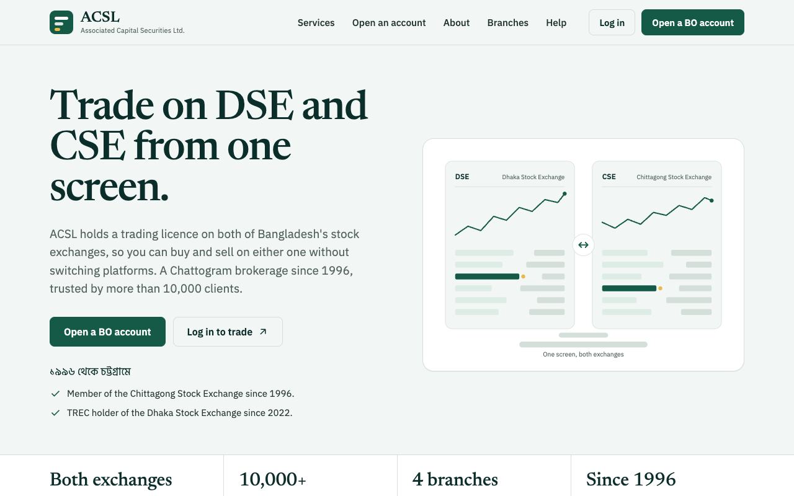

# ACSL website

A single-file redesign concept for [acslbd.com](https://acslbd.com), the website of Associated Capital Securities Limited (ACSL), a stock brokerage in Chattogram, Bangladesh.

**Live:** https://zaeemrahman.github.io/acsl-website/



## What it is

- One self-contained `index.html`: inline CSS, about 25 lines of vanilla JavaScript, one inline SVG illustration. No framework, no build step, no image files.
- Every fact on the page comes from the old site, rewritten in plain English. Nothing invented.
- Light mode only, by decision. See `CLAUDE.md` for the editing rules.

## Lighthouse

Lighthouse 12, mobile, against the live site on 19 September 2026.

| Performance | Accessibility | Best practices | SEO |
|---|---|---|---|
| 98 | 100 | 100 | 60 |

SEO is held down on purpose: the page carries a `noindex` tag until ACSL adopts the redesign, so the concept does not get mistaken for the firm's real site in search results.

## Status

Redesign concept, not client-approved for launch. Waiting on ACSL for the official logo, a fee schedule, and BSEC and exchange registration numbers. The placeholder logo is an inline SVG.

## Run locally

Open `index.html` in a browser, or serve the folder:

```bash
python3 -m http.server 8000
```
